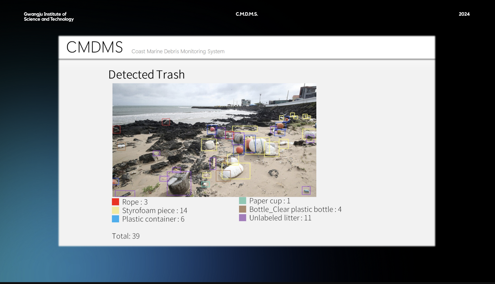

<div align="center">

# 🌊 C.M.D.M.S.

### Coastal Marine Debris Monitoring System

**AI(YOLOv5 + SAHI) 기반 고해상도 UAV 항공 이미지 해양 쓰레기 탐지·정량화 웹 서비스**

*"Monitor Coasts, Monitor Future."*

<br>

`🔍 Detect` &nbsp;·&nbsp; `🏷️ Classify` &nbsp;·&nbsp; `📊 Quantify`

<br>


</div>

---

## 📌 At a Glance

> - 🛰️ **기능** — UAV 촬영 고해상도 항공 이미지를 업로드하면 해양 쓰레기를 **탐지(Detect)·분류(Classify)·정량화(Quantify)**하는 웹 서비스
> - 🧠 **기술** — 실시간 탐지에 강한 **YOLOv5**에 **SAHI(Slicing Aided Hyper Inference)**를 결합해, 고해상도 이미지 속 **미세 객체 탐지 성능**을 극대화
> - 📊 **데이터** — 다양한 실세계 환경에서 수집된 **TACO(Trash Annotations in Context)** 데이터셋(COCO 포맷, 60개 계층 카테고리)으로 학습
> - 🌍 **효과** — 수거 인력·자원의 **효율적 배분**을 지원하고, 정량 데이터 기반 의사결정으로 **해양 생태계 보호**와 **UN SDGs** 달성에 기여

---

## 1. 배경 및 목적 (Problem Statement & Goal)

### 🚨 문제 상황

제주 연안은 계절풍과 태풍의 영향으로 매년 심각해지는 해양 쓰레기 문제에 직면해 있습니다. 특히 **제주시 산북 해안**과 **서귀포시 사계 해안**의 피해가 두드러집니다.

> **2년 만에 총 쓰레기 발생량이 2만 톤을 돌파(약 83% 증가)**했으며,
> 그중 **플라스틱 폐기물이 70.1%**로 가장 큰 비중을 차지합니다.
> 이 외에도 나무, 금속, 고무, 유리 등 다양한 종류의 쓰레기가 발견됩니다.

### ⚠️ 기존 방식의 한계

| 관측 방식 | 주요 한계점 |
| :--- | :--- |
| **수동 현장 관찰** | 넓은 해안선을 사람이 직접 관측 — **시간 소모적·비효율적**, 데이터의 객관성 부족 |
| **일반 드론(UAV) 관측** | 단순 촬영에 의존 — 기술적 지원 없이는 **정확한 쓰레기 양 측정 불가** |

또한 대한민국 **해양수산부**는 매달 인력을 고용해 대응하고 있으나, 계절적으로 급증하는 쓰레기를 제한된 인력만으로 감당하기 어려운 실정입니다.

### 🎯 프로젝트 목적

C.M.D.M.S.는 **UAV 항공 촬영**과 **AI 객체 탐지 기술**을 결합하여 위 문제를 해결합니다.

- 쓰레기의 **양과 종류에 대한 정확한 정보**를 자동으로 산출하고,
- 이를 **웹 대시보드**로 제공하여,
- 수거 단체가 청소에 필요한 **인력과 자원을 사전에 예측·배분**할 수 있도록 지원

궁극적으로 현장 관측의 한계를 넘어 **데이터 기반의 효율적인 해양 정화 의사결정**을 가능하게 하는 것을 목표로 합니다.

---

## 2. AI 방법론 및 데이터셋 (AI Methodology & Dataset)

### 🧩 Base Model — 왜 YOLOv5인가

해양 정화 현장은 방대한 양의 이미지를 신속하게 처리해야 하는 환경입니다. YOLOv5는 이러한 요구에 부합하는 **속도와 정확도의 탁월한 균형**을 제공합니다.

- **One-stage Detector** 구조로 실시간에 가까운 추론 속도 확보
- 경량화된 아키텍처로 **드론·엣지 환경으로의 확장 가능성** 보유
- 검증된 학습 파이프라인으로 **빠른 프로토타이핑** 지원

### 🔬 Enhancement — SAHI를 결합한 이유

고해상도 UAV 이미지는 넓은 영역을 담는 대신, 개별 쓰레기 객체가 전체 프레임에서 차지하는 픽셀 비중이 극히 작습니다. 표준 추론에서는 이러한 **소형 객체(small object)**가 다운샘플링 과정에서 소실되어 탐지 성능이 급격히 저하됩니다.

> **SAHI(Slicing Aided Hyper Inference)**는 원본 고해상도 이미지를 **격자 형태의 작은 슬라이스로 분할**하여 각 조각에 개별 추론을 수행한 뒤, 결과를 **원본 좌표계로 병합(merge)**하는 프레임워크입니다.

UAV가 촬영한 광범위하고 상세한 정보를 처리하는 데 핵심적이며, 다음의 이점을 제공합니다.

- **미세 객체 탐지율 향상** — 슬라이스 내에서 객체의 상대적 크기가 커져 탐지 확률 상승
- **정밀한 정량화** — 놓치던 소형 쓰레기까지 집계에 반영되어 수량 산출 신뢰도 개선
- **모델 재학습 불필요** — 추론 단계(inference-time)에 적용되어 기존 YOLOv5 가중치를 그대로 활용

### 📦 Dataset — TACO (Trash Annotations in Context)

학습에는 숲, 도로, 해안가 등 다양한 환경의 실제 쓰레기 이미지를 담은 **TACO 데이터셋**을 사용했습니다.

| 특징 | 설명 |
| :--- | :--- |
| **다양한 환경** | 숲·도로·해안 등 다양한 배경과 조명 조건에서 수집 |
| **표준 포맷** | 산업 표준인 **COCO 포맷**으로 정밀 라벨링, 파이프라인 호환성 확보 |
| **계층적 분류** | 계층 구조를 통해 **60개 카테고리** 중 하나로 세분화 분류 |
| **Unlabeled Litter** | 모호한 아이템을 **'분류되지 않은 쓰레기'**로 고유 식별 — 쓰레기 인식에 특화된 활용성 |

> 📎 예시 클래스: `Pop tab`, `Single-use carrier bag`, `Plastic film`, `Meal carton`, `Disposable plastic cup` 등

---

## 3. 서비스 워크플로우 (Web Service & Action Flow)

### 🏗️ 시스템 아키텍처

웹페이지·서버·딥러닝 모듈이 분리된 구조로, 요청과 결과가 다음과 같이 흐릅니다.

```text
 ┌──────────────┐   Send image      ┌──────────────┐  Request inference  ┌───────────────────────┐
 │   Webpage    │ ───────────────▶  │    Server    │ ──────────────────▶ │  Deep Learning Module │
 │  (Frontend)  │                   │   (Backend)  │                     │    (YOLOv5 + SAHI)    │
 │              │ ◀───────────────  │              │ ◀────────────────── │                       │
 └──────────────┘   Return result   └──────────────┘    Return result    └───────────────────────┘
```

### 👤 사용자 액션 플로우

사용자는 전문 지식 없이 **4단계**만으로 분석 결과를 얻을 수 있습니다.

```text
 ┌──────────────┐     ┌──────────────┐     ┌──────────────┐     ┌───────────────┐
 │  [1] UPLOAD  │     │ [2] PREVIEW  │     │ [3] LOADING  │     │[4] VISUALIZE  │
 │              │     │              │     │              │     │               │
 │  이미지 업로드 │ ──▶ │ 미리보기·추론  │ ──▶ │  추론 진행 중  │ ──▶ │  결과 시각화   │
 │              │     │              │     │              │     │               │
 │ (.jpg/.png)  │     │  (Continue)  │     │(Please wait…)│     │(Detected Trash)│
 └──────────────┘     └──────────────┘     └──────────────┘     └───────────────┘
```

| 단계 | 사용자 액션 | 시스템 동작 |
| :---: | :--- | :--- |
| **1. Upload** | 고해상도 UAV 프레임 파일(`.jpg`, `.png`) 선택·업로드 | 이미지 유효성 검사 |
| **2. Preview** | 미리보기 확인 후 `Continue` 추론 버튼 클릭 | 이미지 렌더링 및 추론 요청 준비 |
| **3. Loading** | 대기 | `Please wait…` 로딩 인디케이터, 추론 파이프라인 실행 |
| **4. Visualization** | 결과 열람 | 탐지된 쓰레기 종류·수량과 Total을 대시보드로 표시 |

### 📊 결과 예시 (Detected Trash)

실제 UAV 항공 이미지에 대한 탐지 결과 화면입니다. 탐지된 객체는 클래스별로 색상이 구분된 바운딩 박스로 표시되며, 종류별 수량과 총합(Total)이 함께 제공됩니다.

<div align="center">
  
</div>

| 클래스 | 수량 | | 클래스 | 수량 |
| :--- | :---: | :---: | :--- | :---: |
| 🟥 Rope | 3 | | 🟩 Paper cup | 1 |
| 🟨 Styrofoam piece | 14 | | 🟫 Bottle (Clear plastic bottle) | 4 |
| 🟦 Plastic container | 6 | | 🟪 Unlabeled litter | 11 |
| | | | **Total** | **39** |

---

## 4. 기대 효과 (Impact Assessment)

C.M.D.M.S.는 해양 쓰레기를 효과적으로 탐지·분류함으로써 해양 오염 수준을 크게 줄이고, 제주 해안 환경 보전과 다양한 지속 가능한 발전 목표(SDGs) 달성에 기여합니다.

- **💰 효율적인 자원 배분 (Efficient Resource Allocation)**
  쓰레기 밀집 구역과 종류를 데이터로 식별하여, 한정된 인력·장비를 우선순위가 높은 지역에 집중 투입합니다.

- **⏱️ 수거·청소 효율성 향상 (Enhanced Cleanup Efficiency)**
  종류별 수량 데이터를 기반으로 최적의 수거 방법과 계획을 수립해 운영 효율을 높입니다.

- **🐢 해양 생물 보호 (Protection of Marine Life)**
  신속한 오염 현황 파악과 대응으로 쓰레기가 생태계에 미치는 피해를 선제적으로 최소화합니다.

- **🤝 지역 사회 참여 (Community Engagement)**
  누구나 접근 가능한 시각화 데이터를 통해 지역 사회의 관심과 자발적 참여를 이끌어냅니다.

- **♻️ 지속 가능한 발전 달성 (Achievement of Sustainable Development)**
  UN 지속가능발전목표, 특히 **SDG 14(해양 생태계 보전)** 달성에 실질적으로 기여합니다.

---

## 5. 시작 가이드 (Getting Started)

> ⚙️ 아래는 표준 실행 절차의 뼈대입니다. 실제 스크립트 경로·인자에 맞게 수정하여 사용하세요.

### 📋 Prerequisites

- Python 3.8+
- CUDA 지원 GPU (권장)

### 🔧 Installation

```bash
# 1. 저장소 클론
git clone https://github.com/[your-username]/C.M.D.M.S.git
cd C.M.D.M.S.

# 2. 가상환경 생성 및 활성화 (선택)
python -m venv venv
source venv/bin/activate        # Windows: venv\Scripts\activate

# 3. 의존성 패키지 설치
pip install -r requirements.txt
```

### 🚀 Run Inference

```bash
# 이미지에 대한 쓰레기 탐지 추론 실행
python detect.py \
    --weights [모델 가중치 경로 ex: weights/best.pt] \
    --source  [입력 이미지 경로 ex: data/samples/] \
    --slice                          # SAHI 슬라이싱 추론 활성화
```

### 🌐 Run Web Service

```bash
# 웹 서버 실행
python app.py
# 브라우저에서 http://localhost:5000 접속
```

---

## 🛠️ Tech Stack

| 구분 | 기술 |
| :--- | :--- |
| **AI / ML** | `Python` · `PyTorch` · `YOLOv5` · `SAHI` |
| **Dataset** | `TACO (COCO Format)` |


---

## 👥 Team

> 본 프로젝트는 **AI4GOOD 해커톤(2024.03, 광주과학기술원 GIST)**에서 진행되었습니다.

| 이름 | Name | 역할 |
| :--- | :--- | :--- |
| **김동우** | Dongwoo Kim | Leader |
| 김동현 | Donghyeon Kim | Member |
| 김태욱 | Taewook Kim | Member |
| 김서현 | Seohyeon Kim | Member |
| **김명진** | Myoungjin Kim | Member |

### 🙋 My Role — 김명진 (Myoungjin Kim)

> **AI 리서치 · 기술 문서화 (AI Research & Documentation)**

- 해양 쓰레기 모니터링과 환경 지속가능성을 주제로 한 컴퓨터 비전 프로젝트에 참여
- **TACO(Trash Annotations in Context)** 데이터셋 기반 객체 탐지 접근법에 대한 **문헌 및 기술 조사** 수행
- **SAHI(Slicing Aided Hyper Inference)**가 이미지를 겹치는 패치(overlapping patches)로 분할해 추론함으로써 **YOLOv5의 소형 객체(small-object) 탐지 성능**을 향상시키는 원리를 조사하고, GitHub의 오픈소스 구현체를 분석
- 프로젝트 **기획, 발표 준비, 기술 문서화** 지원

---

<div align="center">

**🌊 Monitor Coasts, Monitor Future.**

</div>
